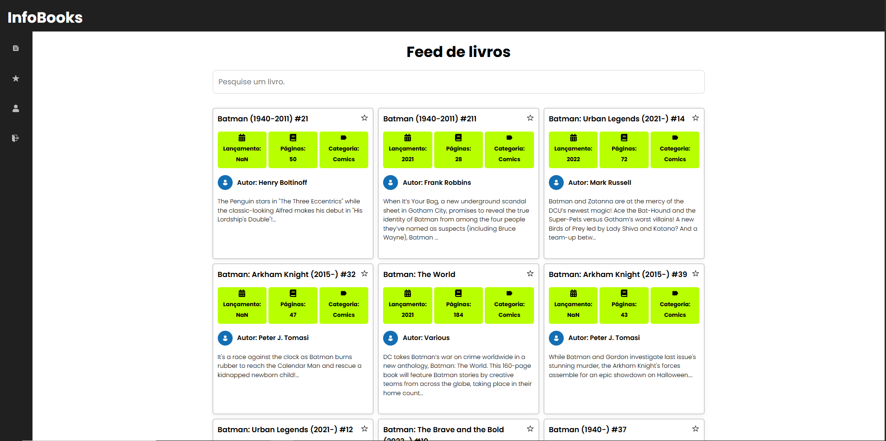

# InfoBooks
Um site contendo diversar informações sobre os livros mais famosos. 

# feed

# Proposta

Site desenvolvido com o intuito de testar conhecimento sobre React, React Router, consumo de APIS. Mas também, Ser uma fonte de informações sobre diversos livros, contendo dados importantes como descrição, link de compra, preço, data de lançamento, autor, etc.

# Tecnologias

O site foi desenvolvido utilizando React.js, para o front-end, e consomi a API do google books https://developers.google.com/books?hl=pt-br
vale lembrar que a autenticação não é segura é utiliza o localStorage, apenas como maneira de treinar autenticação.

# Link

Para usar o projeto basta acessar: 
